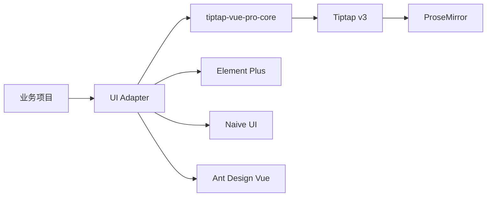
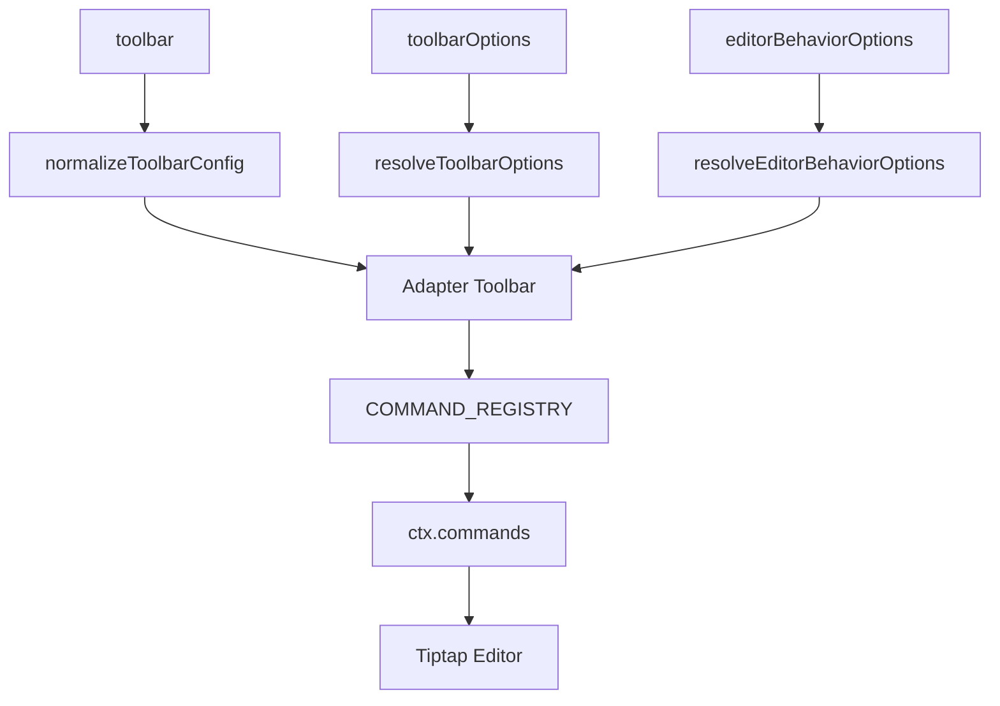
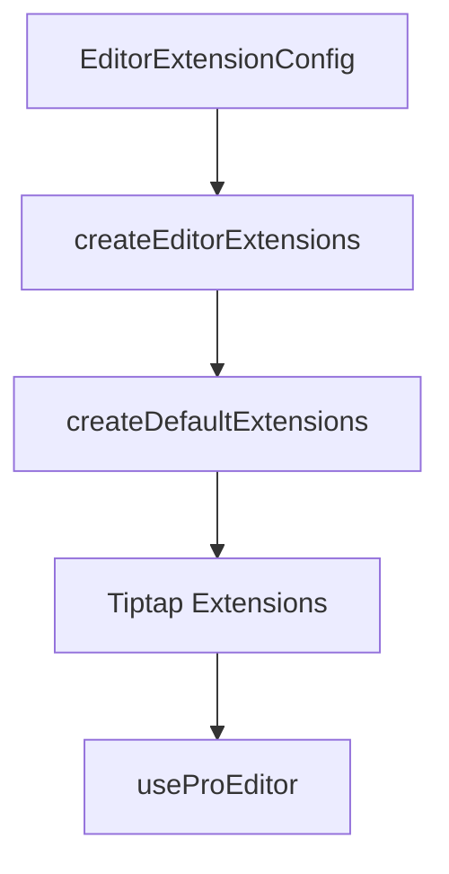

# 整体架构

项目采用 Core + Adapter + Playground 的结构。Core 只处理编辑器能力和类型契约,Adapter 只处理 UI 库接入。

## 目录职责

| 目录 | 说明 |
| --- | --- |
| `packages/core` | `useProEditor`、默认扩展、命令聚合、Markdown、图片上传调度、类型契约 |
| `packages/element-plus` | Element Plus 组件、工具栏、弹窗、气泡菜单、样式 |
| `packages/naive` | Naive UI 组件、工具栏、弹窗、气泡菜单、样式 |
| `packages/ant-design-vue` | Ant Design Vue 组件、工具栏、弹窗、气泡菜单、样式 |
| `playground` | 本地调试和在线 Demo |
| `docs` | VitePress 文档站 |

## 工具栏链路

## 扩展链路

## Adapter 边界

Adapter 之间不能互相引用 UI 组件或样式变量。Element Plus 代码只使用 Element Plus,Naive UI 代码只使用 Naive UI,Ant Design Vue 代码只使用 Ant Design Vue。共享行为统一沉到 Core。
