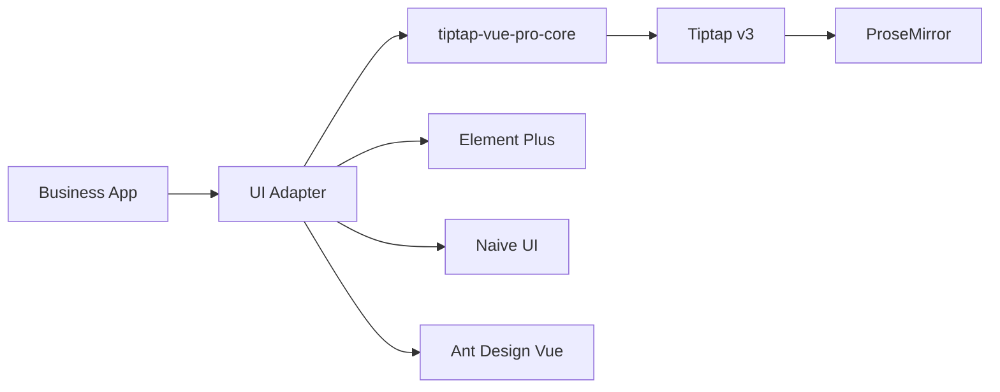
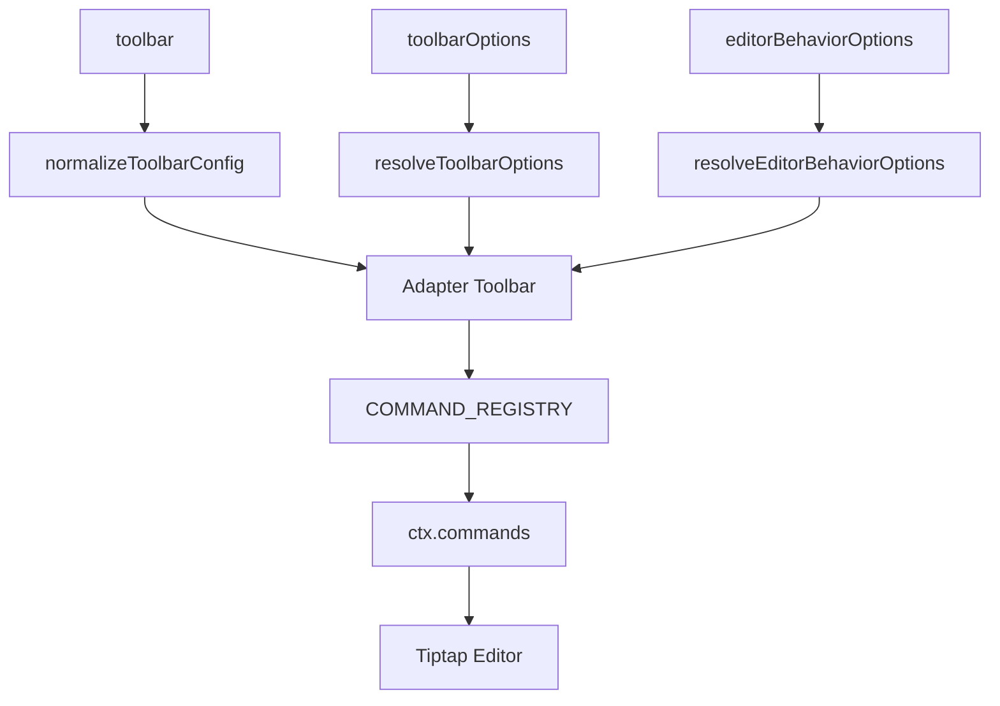
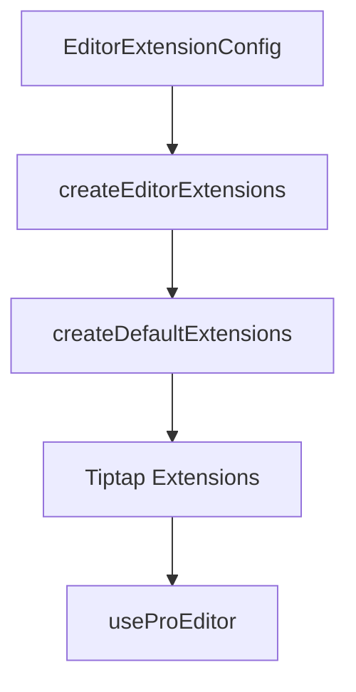

# Architecture

The project uses a Core + Adapter + Playground structure. Core handles editor capabilities and type contracts. Adapters handle UI library integration.

## Directory Responsibilities

| Directory | Responsibility |
| --- | --- |
| `packages/core` | `useProEditor`, default extensions, command aggregation, Markdown, image upload scheduling, developer diagnostics, type contracts |
| `packages/element-plus` | Element Plus components, toolbar, dialogs, bubble menus, styles |
| `packages/naive` | Naive UI components, toolbar, dialogs, bubble menus, styles |
| `packages/ant-design-vue` | Ant Design Vue components, toolbar, dialogs, bubble menus, styles |
| `playground` | Local debugging and online demo |
| `docs` | VitePress docs site |

## Toolbar Flow

## Extension Flow

## Adapter Boundaries

Adapters must not reference each other's UI components or style variables. Element Plus code only uses Element Plus, Naive UI code only uses Naive UI, and Ant Design Vue code only uses Ant Design Vue. Shared behavior belongs in Core.

## Developer Diagnostics Boundary

Diagnostics filtering, content sanitization, and console fallback live in Core. Adapters only report their own UI actions, such as toolbar clicks, dialog opens, and table grip menus; they must not reference another adapter's components, class names, or style variables.
