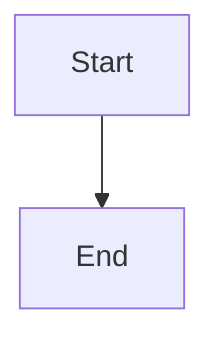

# Mermaid Diagrams

The editor stores Mermaid as a dedicated document block, not as a language option on a regular code block. Use the Mermaid toolbar button or `/mermaid` to insert a split block with valid starter source.

## Three Views

| View | Behavior |
| --- | --- |
| Code | Edit Mermaid source with CodeMirror |
| Diagram | Display the SVG generated by Mermaid |
| Split | Source on the left and diagram on the right; narrow screens stack them vertically |

The selected view is stored in the node's `viewMode` attribute and survives HTML / JSON persistence. Double-clicking a diagram while editable switches to split view and focuses the source. Readonly and preview modes hide the view toolbar.

## Markdown Round Trip

Mermaid blocks import and export as standard fenced Markdown:

````markdown

````

Markdown has no editor-view metadata, so imported blocks default to split view. HTML / JSON preserve `viewMode`. Generated SVG is only a runtime cache and is never stored in the document.

## Loading and Errors

Mermaid and CodeMirror are lazy-loaded. Documents without Mermaid blocks load neither engine, and diagram-only views do not load CodeMirror. Source changes render after a debounce. Invalid syntax preserves the latest valid diagram and marks a source line when Mermaid reports one.

Mermaid runs with `securityLevel: 'strict'`. The first release does not include image export, drag-based drawing, canvas zoom, or autocomplete.
