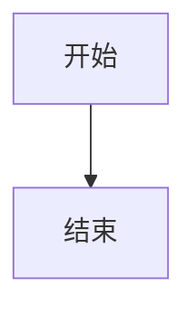

# Mermaid 图表

编辑器把 Mermaid 作为独立文档块,不是普通代码块的一种语言。工具栏的 Mermaid 按钮和 `/mermaid` 都能插入一个带有效初始源码的分屏块。

## 三种视图

| 视图 | 行为 |
| --- | --- |
| 代码 | 使用 CodeMirror 编辑 Mermaid 源码 |
| 图表 | 显示 Mermaid 生成的 SVG |
| 分屏 | 桌面端左侧代码、右侧图表;窄屏自动改为上下布局 |

视图写入节点的 `viewMode` 属性,因此 HTML / JSON 保存后会恢复。双击可编辑状态下的图表会回到分屏并聚焦源码。只读和预览状态隐藏切换工具栏。

## Markdown 往返

Mermaid 块按标准 fence 导入和导出:

````markdown

````

Markdown 不包含编辑器视图信息,重新导入时默认使用分屏。HTML / JSON 会保留 `viewMode`。生成的 SVG 只作为运行时缓存,不会写入文档内容。

## 加载与错误

Mermaid 和 CodeMirror 均按需加载:没有 Mermaid 块的文档不会加载它们,图表视图也不会加载 CodeMirror。源码修改会防抖渲染;语法错误不会覆盖最后一次有效图表,错误行可识别时会在源码中标记。

Mermaid 使用 `securityLevel: 'strict'`。首个版本不包含图片导出、拖拽式绘图、画布缩放或自动补全。
